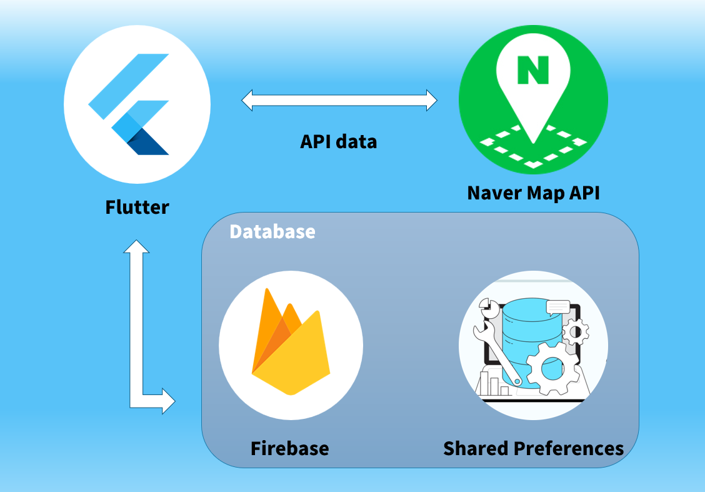

## 🔊 Description
> 헬스를 하는 사람들의 비율이 점차 늘어나고 있습니다.
하지만 사람들은 운동 일지를 기록하지 않아 본인의 변화를 수치상으로 확인하기 어렵습니다.
이러한 사람들의 기록을 도와주기 위해 Routine Mate를 개발했습니다.

> Routine Mate는 헬스를 좋아하는 사람들이 본인의 운동 루틴에 대해 기록하고 확인할 수 있는 앱입니다.
본인이 자주 하는 운동 종목들을 하나의 루틴으로 만들 수 있습니다.
달력으로 과거의 헬스 기록을 확인할 수 있습니다.
헬스장 검색 기능을 통해 내 주변에 있는 헬스장을 찾을 수 있습니다.

## How to Run
* 빌드를 위해, API KEY가 필요합니다.
  *  /lib/main.dart의 `naver_api_key` 코드를 발급 받은 API 키로 바꿔주세요.
```dart
await NaverMapSdk.instance.initialize(clientId: dotenv.env['naver_api_key']); 
//Line no.20, please insert the Google Map API key here
```

* /lib/main.dart에서 Run Code를 진행 해주세요.

## 🛠️ PROJECT Architecture


## 📱 APP Screenshot


<br>
<br>


## R&R
* 김성연: UI, 기능 구현(회원가입, 로그인, 내 주변 헬스장 검색)
* 곽지훈: UI, 기능 구현(루틴 관리, 타이머, 헬스 일지)


